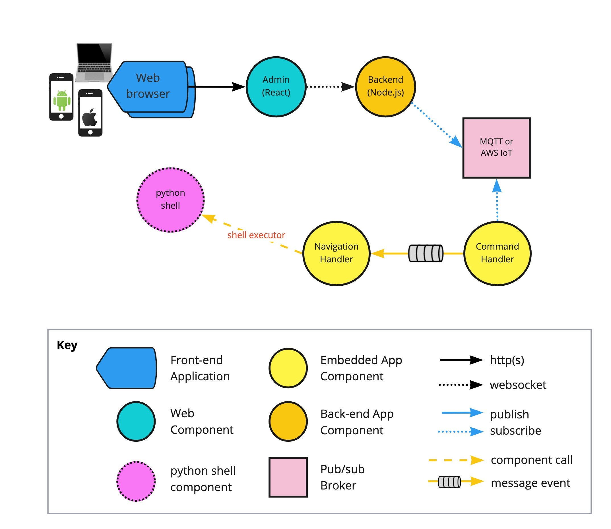

# Backend Tutorial

This repository contains the sample codes for Node.js backend.

The tutorial covers the following system using Dialogflow. Please see 🎸[Tutorial](https://rubenchoi.tistory.com/33) for more detail.

## Install & Run

1. npm install
2. node backend.js

Please see 🎸[Tutorial](https://rubenchoi.tistory.com/33) for more detail.
